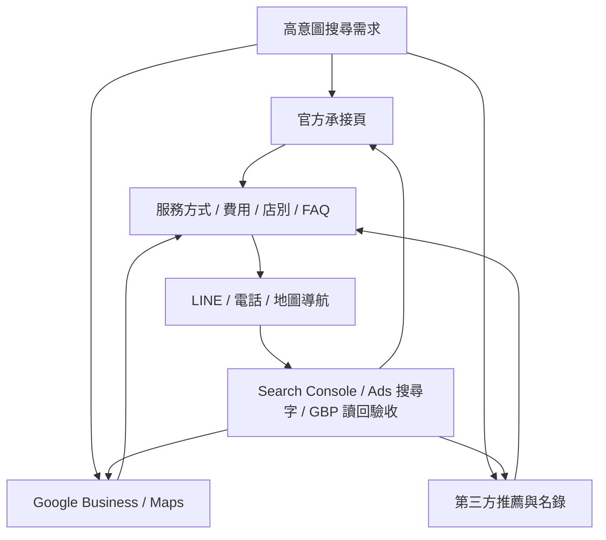

# 自然搜尋成長目標地圖 - 2026-05-19

## 這份文件是什麼

這份文件把「競品為什麼有流量」拆成見觀必須逐步補齊的目標地圖。它不是靈感清單，也不是單次 SEO 任務，而是後續自然搜尋、Google 商家、外部曝光與轉換驗收的主工作圖。

可稱為：

- 目標地圖
- 成長 Roadmap
- SEO 戰略地圖
- 自然搜尋任務地圖

本專案後續統一稱為「自然搜尋成長目標地圖」。

## 總目標

讓 `台南整復`、`台南整復推拿`、`台南整骨推薦`、`台南整復推拿推薦`、北區 / 南區整復推拿、費用與到店前比較需求，最後被導回見觀自己的官方頁面、Google 商家檔案、LINE / 電話聯絡入口。

這裡的成效目標不是泛流量，而是：

- 高意圖搜尋能看到見觀。
- 使用者能分清楚北區店、南區店、服務方式、費用與預約方式。
- 舊 URL 與外部錯誤資訊逐步退場。
- Google Business Profile、第三方入口與官網資料一致。
- LINE / 電話點擊這類聯絡意圖增加。

## 合夥人溝通版

如果合夥人問「我們現在到底在做什麼」，可以這樣說：

```text
我們現在不是單純叫 AI 寫文章，也不是只做 Google 商家貼文。

我們是在把見觀的自然搜尋營運系統補起來：先讓台南整復、整復推拿推薦、費用、北區南區這些高意圖搜尋，有自己的官方承接頁；再把舊網址轉到正確頁，避免過去累積的搜尋流量流失；同時整理 Google 商家、照片、貼文、第三方名錄和外部入口，讓外面看到的見觀資料都一致。

競品流量大，不只因為官網文章，而是他們在 Google 商家、推薦平台、服務頁、地區字、費用字、照片和評價上都有入口。我們現在就是把這些入口一個一個補齊，而且每一項都用 Search Console、公開搜尋和後台讀回驗收，不是憑感覺做。
```

再短一點：

```text
我們在做的是自然搜尋成長，不只是發文。
目標是讓正在找台南整復推拿、推薦、費用和南北店資訊的人，最後看到見觀、信任見觀，並走到 LINE、電話或到店導航。
```

用營運語言拆成五件事：

| 問題 | 我們在做什麼 | 為什麼重要 |
| --- | --- | --- |
| 搜尋的人找不到正確頁 | 建服務頁、FAQ、費用與店別入口 | 把高意圖流量接回官網 |
| 舊網址還在 Google 裡 | 做 301 與 Search Console 追蹤 | 避免舊流量浪費或進錯頁 |
| Google 商家是主要入口 | 對齊網站、預約、照片、貼文、服務項目 | Maps / local pack 會直接影響來客 |
| 第三方推薦頁吃流量 | 盤點名錄與推薦平台，準備官方資料包 | 不能只靠自己官網，外部入口也要正確 |
| 不知道做完有沒有用 | 每週看 GSC、公開搜尋、Ads 搜尋字、LINE / 電話 proxy | 把 AI 變成執行工具，不是憑感覺做事 |

## 目前證據

- Search Console 前 3 個月：總點擊 `469`、總曝光 `13,386`、平均 CTR `3.5%`、平均排名 `7.5`。
- Search Console 全期間：總點擊 `2,235`、總曝光 `67,599`、CTR `3.31%`、加權平均排名 `9.22`。
- 服務核心詞前 3 個月已有 `90 clicks / 4,389 impressions`，全期間 row sum 為 `440 clicks / 27,938 impressions`。
- 舊 `.php` URL 長期佔據頁面報表，全期間舊 URL row sum 為 `1,045 clicks / 125,473 impressions`。
- 公開 SERP 觀察顯示，競品與第三方頁吃流量的原因包含：直白 title、服務矩陣、地區頁、Google 評價 / 照片、第三方推薦頁、費用與比較型內容。

## 目標地圖



## 必要工作分層

| 層級 | 必要工作 | 目的 | 狀態 |
| --- | --- | --- | --- |
| 1. 技術與索引地基 | 舊 `.php` URL 301、canonical、sitemap、robots、Search Console 觀察 | 讓舊搜尋結果正確導向新頁，避免搜尋權重和使用者流失 | 第一批 301 已驗收，仍需後續看 GSC 舊 URL 是否下降 |
| 2. 官方服務承接 | `/services/tainan-tuina/`、首頁、北區、南區、FAQ、費用頁互相支撐 | 把服務核心詞從首頁和舊 URL 導回正確頁面 | 已完成第一版，需依 GSC 迭代 |
| 3. 推薦型搜尋承接 | `台南整復推拿推薦怎麼看`、怎麼選、費用怎麼看、整復推拿 / 運動按摩 / 物理治療差異 | 承接「推薦」「費用」「比較」搜尋，不做假排行 | 已有第一版，需要補內容群 |
| 4. Google Business / Maps | 南北店網站、預約、服務、照片、貼文、公開面讀回 | local pack 和地圖流量是最大外部入口 | 貼文已發布，公開面仍需讀回 |
| 5. 第三方曝光 | 推薦平台、名錄、旅遊評論頁、社群公開入口、外部一致資料包 | 競品流量大的一部分來自非官網入口 | 已整理清單，尚未實際申請或接觸 |
| 6. 信任素材 | 環境照、門面照、服務邊界、費用透明、常見問答、真實評論 | 提高點擊後的信任與聯絡意圖 | 部分已有，照片與評論素材需店主介入 |
| 7. 內容群與內鏈 | 身體觀察筆記、搜尋問法、費用、店別、服務邊界、到店前準備 | 讓網站不只靠單一服務頁排名 | 已有 notes 基礎，需補服務型內鏈與 FAQ |
| 8. 成效回讀 | Search Console、公開 SERP、Google Business、Ads 搜尋字、LINE / 電話 proxy | 避免憑感覺改頁，讓每次修改有驗收依據 | 每週流程已建立，需固定執行 |

## P0 必做

### 1. 舊 URL 與索引收斂

- 持續驗收 8 條優先舊 URL 的 `301` 是否穩定。
- 1 到 2 週後讀 Search Console，看舊 `.php` URL 曝光和點擊是否下降。
- 若 Search Console 仍出現高曝光舊路徑，補第二批 Redirect Rules。
- 維持 `sitemap.xml`、canonical、robots、`llms.txt` 一致。

驗收：

- 舊 `.php` URL live HTTP 仍回 `301`。
- GSC 頁面報表中舊 URL row count / impressions 逐步下降。
- 新服務頁開始承接 `台南整復`、`台南整復推拿`、`台南整骨推薦` 等 query。

### 2. 服務主線頁持續吃搜尋

- 持續觀察 `/services/tainan-tuina/` 是否進入 Search Console query / page 報表。
- 若有曝光無點擊，優先調整 title / description，不急著新增薄頁。
- 若首頁仍吃掉服務詞曝光，補內鏈與頁面摘要，把使用者導回服務頁。
- 不把 `按摩`、`運動按摩` 泛流量硬吃成主要定位。

驗收：

- `/services/tainan-tuina/` 出現在核心 query 的頁面配對。
- CTR 低的 query 有對應 title / description 調整紀錄。
- LINE / 電話 proxy 沒有因泛流量增加而稀釋。

### 3. Google Business 公開面讀回

- 確認南北店公開 Google 商家面板是否顯示新服務頁導流貼文。
- 檢查網站、預約、產品與服務連結是否仍指向官方 URL。
- 兩店 `1 筆 Google 資訊更新` 只讀回，不為了清提示亂改欄位。
- 不重發同一則服務頁導流貼文。

驗收：

- 後台確認貼文存在。
- 公開面顯示時再記錄，不提前宣稱。
- 南北店 URL、電話、地址不混淆。

## P1 必做

### 4. 推薦與比較內容群

要補的內容不是假排行，而是中立判斷標準：

- `台南整復推拿推薦怎麼看`
- `台南整骨推薦怎麼看`
- `整復推拿、運動按摩、物理治療差在哪`
- `整復所是什麼`
- `台南整骨費用 / 全身整復費用怎麼看`
- `北區店和南區店怎麼選`
- `第一次到店前要先知道什麼`

可放位置：

- 先補 FAQ 與服務頁段落。
- 若 GSC 有穩定曝光，再拆成獨立文章或搜尋問法頁。

驗收：

- Search Console 出現相關 query。
- CTR 低時能調整標題摘要。
- 內容不使用 `第一名`、`保證改善`、`治療`、`根治`、不實競品比較。

### 5. 第三方入口補位

必要觀察與評估：

- Google Business Profile。
- 七分之二、Gomaji、Wanderlog 類推薦 / 名錄頁。
- Dcard / PTT 類推薦查詢，但不自導自演。
- Instagram / Facebook / LINE 官方入口和官網資料一致。
- 地方目錄或商家資料庫是否已有錯誤資訊。

先做順序：

1. 找出目前已收錄見觀但資料錯誤的平台。
2. 找出高排名第三方頁是否能合法申請收錄。
3. 優先補官方 URL、店點、服務邊界、照片。
4. 暫緩優惠券平台，除非確認要承接低價導向流量。

驗收：

- 每個外部入口都有正確官方 URL。
- 沒有假評論、假排行、競品攻擊。
- 外部頁導回 `/services/tainan-tuina/`、`/visit/` 或對應分店頁。

### 6. 信任素材補強

需要補齊的不是口號，而是能降低使用者不確定感的素材：

- 北區門面 / 空間 / 到店路線照片。
- 南區工作室 / 預約制說明照片。
- 不分店別的品牌圖、服務頁導流圖。
- 費用表與服務時間說明。
- 真實常見問題。
- 可公開使用的評論 / 回饋，但必須有授權，不改寫成療效保證。

驗收：

- Google Business 照片與官網照片方向一致。
- 分店頁不只剩文字，有可辨識的到店信任素材。
- 費用與預約說明清楚，減少低品質詢問。

## P2 必做

### 7. 內容群與內鏈厚度

從既有 notes 和 FAQ 延伸，不大量開薄頁：

- 高曝光身體狀態詞：富貴包、骨盆、肩頸、駝背、高低肩。
- 搜尋問法：整復、整骨、推拿、喬骨、美式整復、整脊。
- 到店前判斷：什麼狀況適合先看醫療、什麼狀況可先看服務邊界。
- 每篇內容都要自然導回服務頁、FAQ、南北店頁或費用頁。

驗收：

- 內鏈不是堆關鍵字，而是讓使用者能下一步。
- 高意圖 notes 有導回 `/services/tainan-tuina/`。
- 沒有醫療診斷或療效保證語氣。

### 8. 評價與口碑策略

這部分不能用技術或文案硬做，必須靠真實營運：

- 鼓勵真實顧客留下 Google 評價。
- 回覆評價時保持安全語氣，不寫療效承諾。
- 把常見問法整理成 FAQ，不直接引用個資或敏感內容。
- 不買評價、不用假帳號、不做 Dcard / PTT 假推薦。

驗收：

- 評價量與回覆品質穩定增加。
- FAQ 可以反映真實問題，但不暴露個資。
- 口碑內容不違反平台規範。

## 需要店主或人工介入

| 項目 | 為什麼需要人工 | Codex 可先做什麼 |
| --- | --- | --- |
| Google Business 照片 / 貼文 / 欄位 | 需要登入、權限與公開發布判斷 | 準備文案、URL、檢查清單、發布後讀回 |
| 第三方名錄申請 | 可能需要電話、統編、地址、照片授權或付款 | 整理平台清單、官方介紹、欄位資料 |
| 評論與顧客回饋 | 必須真實，不可偽造 | 整理安全回覆原則與 FAQ 方向 |
| 實拍素材 | 需要店內現場照片 | 指定需要哪些照片與用途 |
| Search Console / GBP 後台讀回 | 需要登入 | 讀回、整理成任務、避免誤判 |

## 不做清單

- 不做不存在的分店頁。
- 不做競品攻擊頁。
- 不做假排行榜。
- 不自稱 `台南第一`、`最有效`。
- 不寫 `治療`、`根治`、`保證改善` 等醫療或療效承諾。
- 不買假評論、不假裝 Dcard / PTT 使用者。
- 不為了吃 `按摩` 泛流量，把見觀改寫成一般按摩店。
- 不把 LINE / 電話點擊寫成已預約、已成交或已到店。

## 每週工作節奏

每週只選 1 到 3 件，不要同時亂開很多頁。

固定順序：

1. 讀 Search Console：query、page、CTR、position。
2. 讀 Ads search terms：確認付費搜尋有哪些新需求或雜訊。
3. 查公開 SERP：核心字、推薦字、地區字、local pack。
4. 查 Google Business：南北店欄位、貼文、公開面狀態。
5. 選任務：先修已有曝光的頁，再補缺口。
6. 驗收：改完後讀回 live 頁、提交、下週看資料。

## 近期優先順序

| 優先級 | 任務 | 是否需要店主 | 驗收 |
| --- | --- | --- | --- |
| P0 | 1-2 週後讀回 Search Console，看服務頁是否開始承接核心 query | 需要登入 | GSC query / page 配對 |
| P0 | 讀回 Google 搜尋 / Maps 公開面是否顯示服務頁導流貼文 | 不一定，需要乾淨瀏覽器 | 公開面截圖與紀錄 |
| P0 | 追蹤 `台南推拿` / `台南整復推拿` Maps 排名與 GBP 類別缺口 | 不一定；後台比對需登入 | 見觀是否進第一視窗 / 前 10 名、競品類別與評論對照 |
| P0 | 觀察舊 `.php` URL 是否下降，必要時補第二批 redirect | 不一定 | HTTP 301 + GSC 頁面報表 |
| P1 | 補「整復所是什麼」「第一次到店前」「北區南區怎麼選」FAQ / 內容段落 | 不需要 | live 頁讀回、GSC 後續曝光 |
| P1 | 盤點外部名錄是否已有錯誤資料或缺席 | 可能需要 | 外部入口清單與修正需求 |
| P1 | 規劃南北店照片素材清單 | 需要店主拍攝 | 照片用途表 |
| P2 | 從 notes 補內鏈到服務頁與 FAQ | 不需要 | 內鏈讀回 |
| P2 | 建立安全評論回覆原則 | 需要店主執行 | 回覆範本與禁語 |

## 判斷是否真的有進展

不能只看「有沒有發文」或「有沒有新增頁」。

真正進展看這些：

- 核心服務 query 的曝光增加。
- 推薦型 query 的 CTR 改善。
- `/services/tainan-tuina/` 開始接到服務搜尋。
- 舊 `.php` URL 曝光下降。
- Google Business / Maps 顯示正確 URL 與貼文。
- 第三方入口資料一致，且導回官方頁。
- LINE / 電話 proxy intent 沒有被泛流量稀釋。
